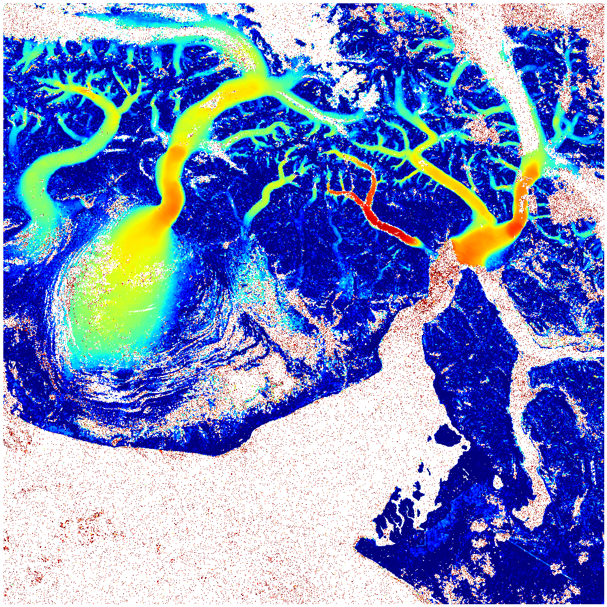
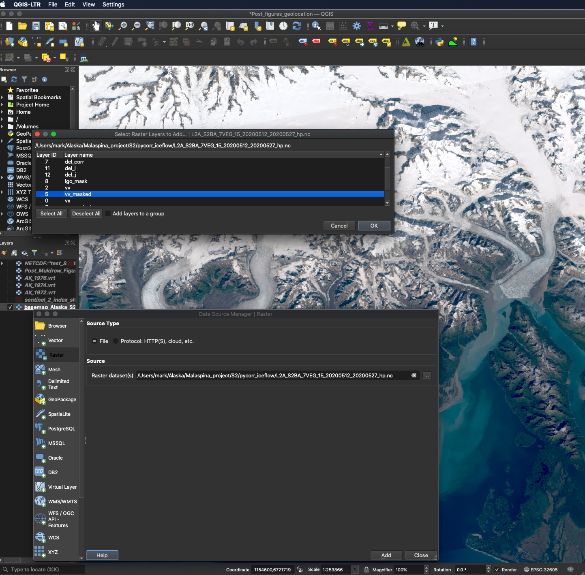
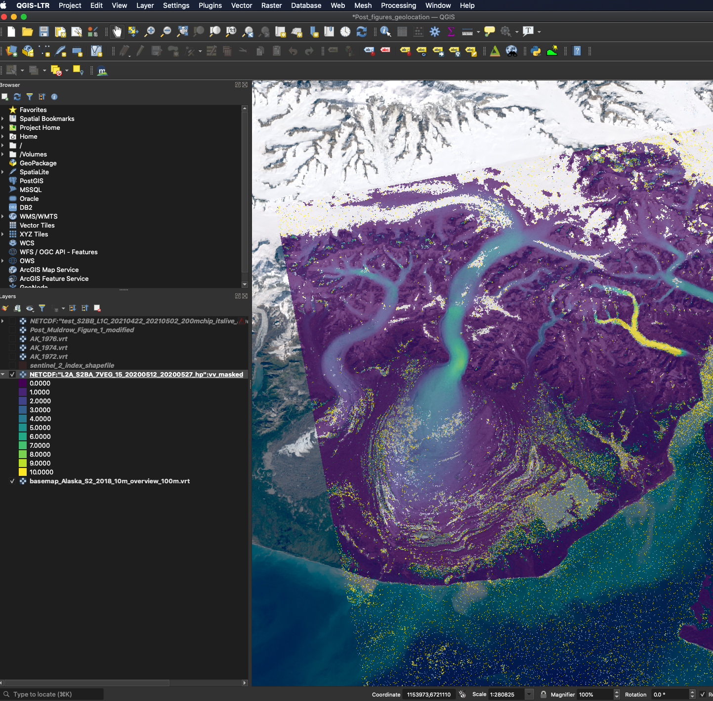

# pycorr_iceflow

# Ice flow "feature" offset tracking in satellite images

## basic fuction
`pycorr_iceflow_1.1.py` is based on the approach described in [Rapid large-area mapping of ice flow using Landsat 8](https://www.sciencedirect.com/science/article/pii/S003442571530211X) and the production code used for the [GoLIVE Landsat 8 processing](https://nsidc.org/data/golive) at NSIDC. It determines offsets at a user-specified grid spacing by comparing a square patch of pixels (a "chip") from an earlier image to the pixels in a larger square patch in a later image using the openCV cv2.matchTemplate function, a dft-based cross correlation which returns a correlation surface at integer pixel offsets between the two image chips.  Sub-pixel offset is determined by finding the peak of the spline of the correlation surface in the vicinity of the highest integer correlation peak.

---
## why pycorr?
pycorr is a "relatively" light weight python script that exploits [GDAL](https://gdal.org) and [openCV](https://opencv.org) to rapidly determine offsets in an image pair. Because it uses GDAL for image I/O, it can use image pairs in many geospatial formats, with the caveat that the images do overlap some spatially and that their image pixels have the same size. pycorr produces a netCDF4 file with offsets and correlation values at a user-specified grid resolution in the same projection as the original images.

There are a number of packages that provide similar analyses and may have more sophisticated approaches to identifying and filtering "noisy" matches, which can be due to cloud cover, surface change, low contrast features or an absence of features, shadows, and low signal-to-noise input imagery.  pycorr is intentionally simple - it does not use a series of larger chip sizes if the initial match fails to find a peak at a location; it returns a limited set of metrics that help document the uniqueness and strength of a peak that can be used to filter the output, but it does not attempt to provide an error estimate for each match.

pycorr is computationally fast because of the use of numpy and the openCV library, and so can process an image pair in minutes or tens of minutes depending on the image sizes and requested grid spacing and maximum offset specified for the search.  This process can be sped up by using land and ocean masks to limit search distances off of the ice and also by using reference ice flow speed maps to set search distances larger in fast flowing areas and smaller in slow flowing areas, but for simplest uses these are not applied.

---
## installation
The libraries required to run pycorr can be installed into a local environment with [Anaconda](https://www.anaconda.com/products/individual) pulling from the [conda-forge](https://conda-forge.org) repository:
### create environment
```
 conda create --name test_pycorr_env -c conda-forge numpy matplotlib gdal=3.1.2 netCDF4 psutil scipy opencv ipython fiona shapely pyproj boto3 git
```

At the time of writing (5/5/2021) the current gdal in conda-forge (3.2.2) did not install python bindings properly - version 3.1.2 was specified here to avoid this issue.

### clone the repository
```
git clone https://github.com/markf6/pycorr_iceflow.git
```

[From this repository the only file you need at this point is pycorr_iceflow_1.1.py]

---
## example run
### activate the conda environment:
```
conda activate test_pycorr_env
```


#### get two Sentinel 2 images from the [AWS S2 Level2A CloudOptimizedGeotiff (COG) public data archive](https://registry.opendata.aws/sentinel-2-l2a-cogs/)

```
curl https://sentinel-cogs.s3.us-west-2.amazonaws.com/sentinel-s2-l2a-cogs/7/V/EG/2020/5/S2B_7VEG_20200512_0_L2A/B08.tif --output S2B_7VEG_20200512_0_L2A_B08.tif
curl https://sentinel-cogs.s3.us-west-2.amazonaws.com/sentinel-s2-l2a-cogs/7/V/EG/2020/5/S2A_7VEG_20200527_0_L2A/B08.tif --output S2A_7VEG_20200527_0_L2A_B08.tif
```

### run pycorr on this image pair, generate output netCDF4 (.nc) data file and browse GeoTIFF (with log colorscale)
```
python pycorr_iceflow_v1.1.py -imgdir . S2B_7VEG_20200512_0_L2A_B08.tif S2A_7VEG_20200527_0_L2A_B08.tif \
                              -img1datestr 20200512 -img2datestr 20200527 -datestrfmt "%Y%m%d" \
                              -inc 10 -half_source_chip 10  -half_target_chip 55 -plotvmax 25 -log10 \
                              -out_name_base L2A_S2BA_7VEG_15_20200512_20200527 -progupdates -use_itslive_land_mask_from_web
 ```
### output files

the output browse image (speed represented by log colorscale, with dark red = 25 m/d (-log10 -plotvmax 25))


The output netCDF4 file (L2A_S2BA_7VEG_15_20200512_20200527.nc) can be opened as a raster in QGIS - choose the "vv_masked" layer to get ice flow speed, or vx_masked and vy_masked to get the vector components of the flow speed in projection x and y meters/day.

selecting vv_masked layer from netCDF4 .nc file




The selected layer, with colorscale applied



---
## major sources of error
As a working point of reference the offsets determined in images of good quality over surfaces with recognizable features can be determined to 0.1 pixels or better. It is difficult to quantify this accuracy for any single match however. A sense of the background accuracy of the matching process for an image pair can be gained by looking at the scatter in the offsets determined for land pixels. Note that this scatter is likely similar for images separated in time by a few days or for a year - meaning that the same scatter would produce a much larger scatter in velocity determined from a few-day pair than from a pair with longer time separation. It is always a tradeoff to use longer pairs for accuracy if the ice you are studying has rapid variations in velocity over time - every image pair velocity field is a time-averaged displacement measurement.

A typical Landsat or Sentinel 2 satellite image has a geolocation accuracy that may be tens of meters - this can translate into an offset between two images of a few pixels.  This simple offset is the largest source of error in a velocity determination if the time interval between two images is short - a 15m (one pixel) offset for a 16-day Landsat 8 pair would result in a background "speed" over land of nearly 1 meter/day.  The same offset for an image pair that had a 365-day time separation would produce a background "speed" over land of a few cm/day.  For most slow flowing ice, if there is a significant amount of land visible in the imagery, one will want to use a land mask that can identify the non-ice pixels, so that the background offset can be removed at the time of processing.  This version of pycorr is able to use the global land masks that are presently online as part of the [ITS_LIVE project](https://its-live.jpl.nasa.gov), but this will require an internet connection at the time the code is run.  It is also possible to have your own local mask file - either a land(1)/glacier(0)/water(0) mask or a water(2)/land(1)/glacier(0) mask will work - it will be reprojected and sampled at the output grid resolution during processing. The second of these will also allow limiting search distances over water, speeding up processing.


A second common source of error is internal distortion in the satellite imagery because of limited accuracy in the surface elevation model used by the image provider to geolocate the pixels in the image. While many optical imagers take images from a near-nadir viewpoint, the width of the image swath is large enough that pixels near the edge of the swath are viewed from an angle off nadir - meaning that any error in an elevation model used to map those pixels to the surface of the Earth will mis-locate them relative to pixels in the image center.  If the ground location in question is to the right of the satellite on one pass, and to the left on an adjacent pass, then the topographic error will produce offsets in opposite directions. This parallax is the signal that is used to map topography from stereo imagery, but for ice flow mapping it isn't a good thing. It is also the case that topographic errors are much more common over rapidly flowing or rapidly melting ice than over any other land cover type.  There is a simple solution to this problem: **use images from the same orbit track** so that the topographic distortion is essentially the same in both images - this eliminates 95% of the issue.  For Landsat this means using image pairs with the same path and row designations. For Sentinel 2 there is a similar "track" in the metadata, but the easiest approach is to use images separated by multiples of 5 days - so a 5 day S2A x S2B pair, or a 10 day S2A x S2A or S2B x S2B pair (Sentinel 2 A and B are in 10-day repeat orbits, staggered 5 days apart).


